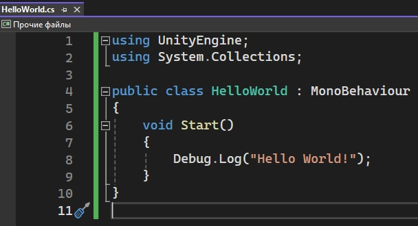

# Анализ данных в разработке игр
Отчет по лабораторной работе #1 выполнил:
- Мурашов Сергей Алексеевич
- НМТ-233004

## Отметка о выполнении заданий
| Задание   | Выполнение | Баллы |
| --------- | ---------- | ----- |
| Задание 1 | *          | 60    |
| Задание 2 | *          | 20    |
| Задание 3 | *          | 20    |

Знак "*" - задание выполнено; знак "#" - задание не выполнено;

## Работу проверили
- к.т.н., доцент Денисов Д.В.
- к.э.н., доцент Панов М.А.
- ст. преп., Фадеев В.О.

## Структура отчета
- Данные о работе: название работы, фио, группа, выполненные задания.
- Цель работы.
- Задание 1.
- Задание 2.
- Задание 3.
- Выводы.

## Цель работы
Установить необходимое программное обеспечение, которое будет использоваться для работы с инструментами анализа данных и разработки игр.

### Задание 1
Задание: Написать программу Hello World на Python с запуском в Jupiter Notebook.  
Ход работы:
- Скачать Anaconda и запустить Anaconda-Navigator.
- Запустить инструмент Jupyter Notebook и создать файл с именем HelloWorld.jpynb.
- Написать в созданный файл команду ```print('Hello World')``` и выполнить.  


### Задание 2
Задание: Написать программу Hello World на C# с запуском на Unity.  
Ход работы:
- Установить Unity Hub.
- Установите последнюю актуальную версию Unity.
- Установить среду для работы с языком C#.
- Создать новый 3D проект.
- Написать программу Hello World на C#.
- Добавить пустой GameObject.
- Добавить к GameObject написанный script
- Запустить.  



### Задание 3
Задание: Какую сущность(и) мы бы могли «обучить» ML-Agent-ом для того чтобы создать более качественный игровой опыт?.  
Система управления врагами:
- Мы можем использовать «обучение» для создания противников, которые могли бы разрабатывать тактику против игрока.
- Мы могли бы добавить класс противников, для которых реализация их поведения вручную являлась бы сложной и подверженной ошибкам. Например, враг-медик, который воскрешал бы убитых союзников. В задачи медика входило бы: избегать получения урона, расставлять приоритеты (кого поднимать в первую очередь), учитывать расстояние до союзников. Для реализации такого противника подошло бы «обучение» ML-Agent-ом.

## Выводы
- Установил Anaconda и Unity.
- Узнал как создавать и запускать файлы в Jupiter Notebook.
- Узнал как запускать на Unity скрипты написанные на C#.